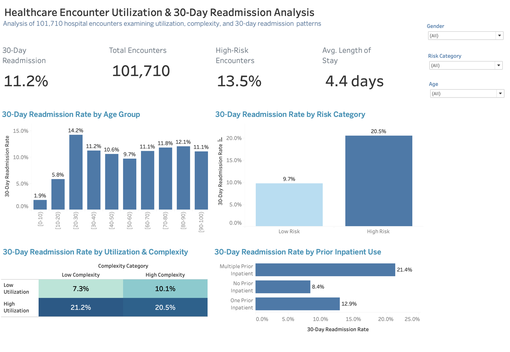

# Healthcare Encounter Utilization & 30-Day Readmission Analysis

An end-to-end healthcare analytics project using **Google BigQuery SQL** and **Tableau** to examine whether prior healthcare utilization and clinical complexity are associated with 30-day hospital readmission.



## Project overview

Hospitals need practical ways to identify encounters that may require stronger discharge planning and follow-up. This project develops a transparent rule-based risk framework, validates the underlying SQL logic, and presents the results in a Tableau dashboard.

The analysis uses **101,710 inpatient encounters** from the Diabetes 130-US Hospitals dataset. The unit of analysis is a hospital encounter, not a unique patient.

## Key findings

All results are descriptive, unadjusted associations from one dataset. They do not show that utilization or complexity causes readmission.

- **Overall:** 11.2% of encounters were readmitted within 30 days; average length of stay was 4.4 days.
- **Risk category:** encounters flagged High Risk (13.5% of all encounters) were readmitted at 20.5%, versus 9.7% for Low Risk.
- **Utilization drives most of the signal.** Readmission by utilization and complexity:

| | Low Complexity | High Complexity |
|---|---|---|
| **Low Utilization** | 7.3% | 10.1% |
| **High Utilization** | 21.2% | 20.5% |

  Once utilization is high, adding high complexity does not raise the readmission rate. High Complexity also applies to about three quarters of encounters (74.7%), so it separates them poorly.
- **Prior inpatient use** shows a clear gradient: 8.4% with no prior inpatient stay, 12.9% with one, and 21.4% with multiple.

## Analytical framework

| Dimension | Definition |
|---|---|
| High Utilization | At least 2 emergency visits **or** at least 2 prior inpatient visits |
| High Complexity | At least 8 diagnoses **or** at least 15 medications |
| High Risk | Both High Utilization **and** High Complexity |
| 30-Day Readmission | Original `readmitted` value equals `<30` |

These thresholds are analytical rules created for this portfolio project. They are not a clinically validated prediction model.

## What the project demonstrates

- Created reusable risk and readmission features with `CASE` expressions
- Used subqueries and CTEs to calculate benchmarks and population percentages
- Combined encounter, risk-profile, and follow-up tables with `INNER JOIN` and `LEFT JOIN`
- Built a permanent BigQuery analytical table at the encounter level
- Validated row counts, key uniqueness, join behavior, and derived-category logic
- Used window functions for peer comparisons and within-group rankings
- Built a Tableau dashboard with gender, risk category, and age filters

## Dashboard

- **Browser view:** [amnashahid999.github.io/healthcare-dashboard.html](https://amnashahid999.github.io/healthcare-dashboard.html), built from the same underlying data.
- **Tableau workbook:** [`Healthcare_Encounter_Utilization-Readmission_Analysis.twbx`](Healthcare_Encounter_Utilization-Readmission_Analysis.twbx) contains the data extract needed to open the dashboard in Tableau Desktop or Tableau Public.

Dashboard views include:

- Overall 30-day readmission rate, total encounters, share of High Risk encounters, and average length of stay
- Readmission by age group
- Readmission by prior inpatient use
- Readmission by risk category
- Utilization–complexity comparison

## Repository structure

```text
hospital-readmission-analysis/
├── README.md
├── LICENSE
├── codebook.md
├── methodology.md
├── dashboard-screenshot.png
├── 01_risk_categorization.sql
├── 02_subqueries_ctes.sql
├── 03_joins.sql
├── 04_analytical_table.sql
├── 05_window_functions.sql
└── Healthcare_Encounter_Utilization-Readmission_Analysis.twbx
```

## How to reproduce

1. Download the Diabetes 130-US Hospitals dataset from the [UCI Machine Learning Repository](https://archive.ics.uci.edu/dataset/296/diabetes+130-us+hospitals+for+years+1999+2008).
2. Load the encounter file into BigQuery as `diabetes.staging_diabetic_data`, or replace that table reference in the SQL scripts with your own project and dataset.
3. Run the scripts in numerical order. The supplementary join examples in `03_joins.sql` require the practice tables `diabetes.encounter_risk_profile` and `diabetes.follow_up`.
4. Open the packaged Tableau workbook to explore the dashboard.

See [`codebook.md`](codebook.md) for field definitions and [`methodology.md`](methodology.md) for analytical decisions and limitations.

## Tools

**BigQuery SQL:** aggregation, `CASE`, `COUNTIF`, subqueries, CTEs, joins, permanent tables, validation queries, window functions, and `QUALIFY`  
**Tableau:** calculated fields, KPI cards, comparative charts, and dashboard filters

## Data attribution

The project uses the public Diabetes 130-US Hospitals dataset originally contributed to the UCI Machine Learning Repository. The UCI page lists 101,766 encounters; the staged table analyzed here contains 101,710, and every figure in this repository is computed on those 101,710 encounters. The repository does not redistribute the raw source dataset; the packaged Tableau workbook contains an analytical extract for portfolio demonstration.

## Author

Amna Shahid  
MA, Quantitative Methods in the Social Sciences — Columbia University
